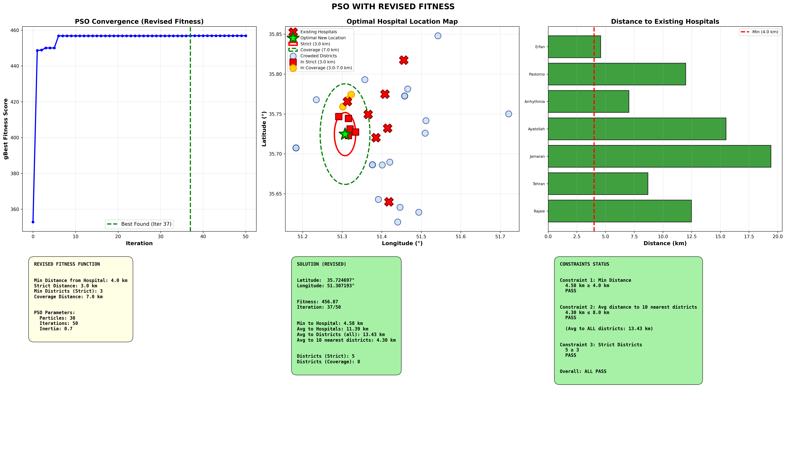

# Tehran Cardiac Hospital PSO

This repository contains a small demo of Particle Swarm Optimization (PSO) for planning the location of a new cardiac hospital in Tehran. The algorithm searches over latitude–longitude coordinates and optimizes a custom fitness function that balances distance from existing hospitals and coverage of crowded districts.

## Quick start
pip install numpy pandas matplotlib scipy
python main.py

## Project structure

- `main.py` – entry point; runs PSO and generates outputs  
- `config.py` – PSO hyperparameters and distance thresholds  
- `core.py` – PSO implementation and fitness function  
- `data_loader.py` – loading CSV datasets  
- `analysis.py` – textual analysis and visualization  

### 3D fitness landscape over the search space

### Overall PSO convergence

Note: The datasets used in this project were manually collected and are currently incomplete. The problem formulation is also simplified and can be made more realistic in future iterations. I plan to improve both the data and the overall logic over time.
